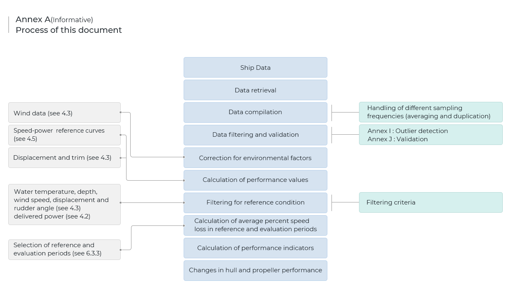

## Table Of Content

* [About](#📋About)
* [ISO19030 Process](#🛳️ISO19030-Process)
    * [Methods](️#⚙️Methods)
* [Attachments](#📁Attachments)
    * [SHIP PARTICULAR](#Particular)
    * [DRAFT](#Draft)
    * [SPEED POWER](#Speed-power)
    * [VOYAGE DATA](#Voyage-data)
    
* [Installation](#✏️Installation)
* [Customize](#🔧Customize-Sample)
* [Contact](#☎️Contact)
* [License](#📜License )


## 📋About 
   Hull and propeller performance refers to the relationship between the condition of a ship’s underwater hull and propeller and the power required to move the ship through water at a given speed. Measurement of changes in ship specific hull and propeller performance over time makes it possible to indicate the impact of hull and propeller maintenance, repair and retrofit activities on the overall energy efficiency of the ship in question.
  
## 🛳️ISO19030 Process


## ⚙️Methods
| Step | Match Method | File
|:---|:---|:---:|
|`Data retrieval`| DataRetrieval | MainProcess.cs
|`Data Compilation`| DataCompilation | MainProcess.cs
|`Data filtering and validation`| BasicFilteringContorller | Filters.cs
|`Correction for environmental factors`| Skip (Set Default Value) | None
|`Caculation of performance values`| PVcalculator, PPVcalculator | DataFunctions.cs
|`Filtering for reference condition`| FilteringForReferenceCondition | Filters.cs
|`Calculation of average percent speed loss in reference and evaluation periods`| Skip | None
|`Calculation of performance indicators`| Skip | None


## 📁Attachments

##### Particular 
| Property | Means | 
|---|:---:|
`BREADTH` | Breadth of ship
`LOA` | Length Of All : length from the tip of the bow to stern
`ME_POWER_MCR` | Power of ME at Maximum Continuous Rating
`TRANSVERSE_PROJECTION_AREA_BALLAST` | Transverse projected area above waterline including superstructures at ballast condition during model test

##### Draft

| Property | Means |
|---|:---:|
`BALLAST_DRAFT_FORE` | DRAFT(FORE SIDE) value at ballast condition during sea trial
`BALLAST_DRAFT_AFT` | DRAFT(AFT SIDE) value at ballast condition during sea trial 
`SCANTLING_DRAFT_FORE` | DRAFT(FORE SIDE) value at scantling condition during sea trial
`SCANTLING_DRAFT_AFT` | DRAFT(AFT SIDE) value at scantling condition during sea trial

##### Speed Power
| Property | Means | 
|---|:---:|
`BALLAST_DRAFT_FORE` |  DRAFT(FORE SIDE) value at ballast condition during sea trial
`BALLAST_DRAFT_AFT` |  DRAFT(AFT SIDE) value at ballast condition during sea trial 
`SCANTLING_DRAFT_FORE` |  DRAFT(FORE SIDE) value at scantling condition during sea trial
`SCANTLING_DRAFT_AFT` |  DRAFT(AFT SIDE) value at scantling condition during sea trial

##### Voyage Data
| Property | Means
|---|:---:|
`ID` | Ship's ID(ex callsign)
`TIME_STAMP` | Time(UTC)
`SPEED_VG` | Ground speed
`SPEED_LW` | Water speed 
`REL_WIND_DIR` | Relative wind direction 
`REL_WIND_SPEED` | Relative wind speed 
`SHIP_HEADING` | ship's heading 
`WATER_DEPTH` | water depth 
`RUDDER_ANGLE` | Rudder angle 
`SW_TEMP` | Sea water temperature 
`DRAFT_FORE` | Draft at Fore 
`DRAFT_AFT` | Draft at Aft 
`ME1_RPM_SHAFT` | ME RPM 
`ME1_SHAFT_POWER` | ME Power 


## ✏️Installation

1. Clone Project Repository 
````
    git clone https://github.com/Lab021/ISO19030.git
````
2. Open the solution file with Visual Studio (Recommed Version 2019)
3. Open Package Manager Console.
4. Input below message on Console.
````
    nuget install packages.config
````
5. Build Project
6. Get Data

## 🔧Customize Sample 
1. Open Csv File in Sample Folder
2. Add Custom Value [See Data Format](#📁Attachments)

## ☎️Contact
>Mail : lab021@lab021.co.kr
<br>Tel : +82 051-462-1029

## 📜License 
This Project is licensed Apache 2.0
